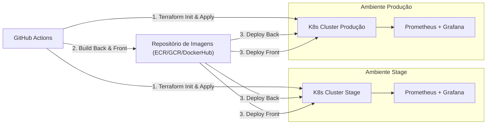

# Estacionamento Web Application

Este repositório contém a aplicação de gerenciamento de estacionamento, incluindo:

* Backend em Java (Spring Boot)
* Frontend em Vue.js
* Configurações de infraestrutura com Kubernetes
* Pipelines de CI/CD para deployment em ambientes Stage e Produção

---

## Índice

* [Visão Geral](#visão-geral)
* [Pré-requisitos](#pré-requisitos)
* [Estrutura do Projeto](#estrutura-do-projeto)
* [Arquitetura](#arquitetura)
* [Como Executar Localmente](#como-executar-localmente)
* [Variáveis de Ambiente](#variáveis-de-ambiente)
* [Pipelines CI/CD](#pipelines-cicd)

  * [Stage](#pipeline-stage)
  * [Produção](#pipeline-produção)
* [Testes e Validação](#testes-e-validação)
* [Rollback e Limpeza](#rollback-e-limpeza)
* [Observações Adicionais](#observações-adicionais)
* [Segurança e Boas Práticas](#segurança-e-boas-práticas)

---

## Visão Geral

A aplicação "Estacionamento Web" permite gerenciar vagas, movimentações de entrada/saída de veículos, cadastro de condutores, marcas e modelos.
Este projeto está preparado para deployment em clusters Kubernetes separados para ambientes **Stage** e **Produção**, com pipelines de CI/CD via GitHub Actions.

## Pré-requisitos

* Java 17+
* Maven
* Node.js 16+ e npm
* Docker
* kubectl
* Terraform 1.x
* Acesso às contas de nuvem (AWS, GCP, Azure ou DigitalOcean)
* GitHub CLI (`gh`) para disparo manual de workflows

## Estrutura do Projeto

```
│
├── API/                 # Backend Spring Boot
├── interface/           # Frontend Vue.js
├── kubernetes/          # Manifests e Helm charts
├── .github/workflows/   # Pipelines CI/CD
├── docker/              # Dockerfiles
├── scripts/             # Scripts auxiliares (smoke tests, validações)
└── README.md            # Este arquivo
```

## Arquitetura



## Como Executar Localmente

1. Clone o repositório:

   ```bash
   git clone git@github.com:seu-usuario/estacionamento-web-application.git
   cd estacionamento-web-application
   ```
2. Configurar variáveis de ambiente (veja seção abaixo)
3. Subir backend:

   ```bash
   cd API
   mvn clean install
   mvn spring-boot:run
   ```
4. Subir frontend:

   ```bash
   cd interface
   npm install
   npm run serve
   ```

## Variáveis de Ambiente

Defina no terminal ou em um arquivo `.env`:

```bash
# Dados da aplicação
APP_PORT=8080
DB_URL=jdbc:postgresql://<HOST>:5432/estacionamento
DB_USER=usuario
DB_PASSWORD=senha

# Kubernetes
KUBE_CONTEXT_STAGE=stage-context
KUBE_CONTEXT_PROD=prod-context

# Registro de Imagens
DOCKER_REGISTRY=seu-registro
DOCKER_USER=usuario
DOCKER_PASSWORD=senha
```

## Pipelines CI/CD

### Pipeline Stage

Arquivo: `.github/workflows/ci-stage.yml`

1. `terraform init` & `terraform apply` no workspace stage
2. Configuração do cluster (`kubectl` + Helm)
3. Build e push das imagens (backend e frontend)
4. Deploy nos clusters Stage
5. Execução de Smoke Tests (`scripts/smoke-test.sh`)

### Pipeline Produção

Arquivo: `.github/workflows/ci-prod.yml`
Mesma sequência do Stage, apontando para as credenciais de produção e executando testes de regressão (`scripts/regression-test.sh`).

## Testes e Validação

* **Smoke Tests:** verifica endpoints críticos após cada deploy.
* **Testes de Integração:** scripts em `scripts/integration-test.sh`.
* **Validação de Observabilidade:** `scripts/validate-monitoring.sh` checa se as métricas estão disponíveis no Prometheus.

## Rollback e Limpeza

* **Rollback de Deployment:** use `kubectl rollout undo deployment/<nome>` no respectivo contexto.
* **Limpeza de Infraestrutura:** execute `terraform destroy` nos workspaces `stage` e `prod`.

## Observações Adicionais

* Estimativa de custo por cluster: \~USD 20/mês (varia conforme uso)
* Políticas de retenção de logs e métricas configuradas no Grafana (7 dias)
* Helm Charts versionados em `kubernetes/helm`

## Segurança e Boas Práticas

* Segredos gerenciados via HashiCorp Vault ou AWS Secrets Manager
* Network Policies no Kubernetes para isolar namespaces
* Escalabilidade automática: HPA configurado nos Deployments

---

*Última atualização: 19 de junho de 2025*
